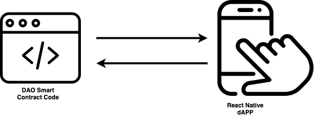

# Build a Decentralized Autonomous Organization (DAO) on Celo.

In this tutorial, we will build a functioning DAO (Distributed Autonomous Organization) by first writing the Solidity smart contract code which will be deployed on the Celo network and then building a React Native App to interact with the smart contract.

&nbsp;

# Introduction.

## What is a DAO? 

A [DAO](https://learn.figment.io/other/glossary#d) is represented as rules encoded as a computer program that is transparent, controlled by the organization members, and not influenced by a central government. It decides which decision will be made by a decentralized organization. 

In non-technical terms: **DAOs are an effective and safe way to work with like-minded folks around the globe**.

Think of DAOs like an internet-native business that’s collectively owned and managed by its members. They have built-in treasuries that no one has the authority to access without the approval of the group. Decisions are governed by proposals and voting to ensure everyone in the organization has a voice.

There’s no CEO who can authorize spending based on their own whims and no chance of a dodgy CFO manipulating the books. Everything is out in the open and the rules around spending are baked into the DAO via its code.

Read more [here](https://ethereum.org/en/dao/). 

**In this tutorial, you will learn how to build a functioning Charity DAO. The smart contract code is deployed on the Alfajores testnet. The contract allows its members to contribute to the DAO. Members can initiate charity proposals which Stakeholders will have to vote on within a specified period of time. After that time has elapsed, the DAO contract will disburse the funds pooled into the Charity DAO.**.

&nbsp;

# Prerequisite

This article assumes that you have basic knowledge of Solidity, JavaScript (TypeScript), and also how to start a React Native App using [expo](https://expo.io/). It is also assumed that you have read the expo documentation and have basic knowledge of the Celo Wallet.

- [Expo](https://docs.expo.io/) is a framework and a platform for universal React applications.
- Learn about the Celo [mobile wallet](https://docs.celo.org/getting-started/alfajores-testnet/using-the-mobile-wallet).
- React Native using [expo](https://docs.expo.io/).
- The Celo DappKit [documentation](https://docs.celo.org/developer-guide/dappkit/setup) is also going to be useful.
- Learn about [Redux](https://redux.js.org/introduction/getting-started) as well.

&nbsp;

# Requirements
For this tutorial, following software needs to be installed:
- React Native
- NodeJS v12 and above
- [Truffle](https://www.trufflesuite.com/)
- The Alphajores Wallet, which will need to be funded using the [faucet](https://celo.org/developers/faucet)

We will cover the project in three parts:: 
- Writing the DAO Smart Contract in Solidity
- Building the React Native App
- Connecting the App with the Smart Contract using Redux

&nbsp;

We will begin by outlining a visual representation of the dApp, its features, and the various screens used in interacting with the smart contract.

&nbsp;

&nbsp;

## Features
The functionality of the app includes: 
- Users connect their Celo Wallet to join the Charity DAO
* Users contribute Celo to become Contributors of the DAO
- Contributors that have made 200 or more total contributions are automatically made Stakeholders.
* Only a stakeholder of the DAO can vote on proposals.
- Contributors and/or Stakeholders can create a new proposal.
* A newly created proposal has a date when voting on it closes.
- Stakeholders can upvote or downvote a proposal.
* Once the expiry date for voting on a Proposal closes, a stakeholder then pays out the requested amount to the Charity.

&nbsp;

This is the overview introduction to the project. The next sections are categorized into 3 parts
Writing the Smart Contract Code.
Building the React Native App.
Connecting the React Native App to the Smart Contract using Redux.

[Part 2](./part-2)